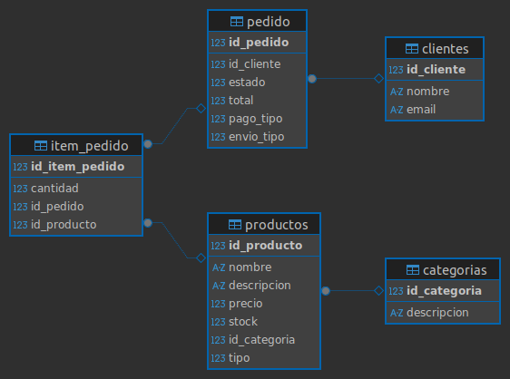

# 📦 Sistema de Inventario - Proyecto para el curso de Diseño de Patrones

Este es un sistema de inventario desarrollado en Java, como parte del curso de **Diseño de Patrones**. Aplica arquitectura limpia (MVC), principios **SOLID**, y varios **patrones de diseño** estudiados en clase.

## 🧠 Patrones de Diseño Aplicados

| Patrón de Diseño     | Uso en el Sistema                                                             |
|----------------------|-------------------------------------------------------------------------------|
| **State**            | Gestión de estados del pedido (Pendiente, Enviado, Entregado, Cancelado)      |
| **Factory Method**   | Creación de métodos de pago y métodos de envío                                |
| **Facade**           | Clase `PedidoFacade` simplifica la creación completa de un pedido             |
| **Observer**         | Implementa las notificaciones por consola, email y SMS                        |
| **Composite**        | Define el comportamiento común para todos los productos, simples o compuestos |
| **Strategy**         | Se utilizo este patron para representar el metodo de pago y envio             |
| **Singleton**        | Controla una única instancia de la clase `ConnectionDB`.                      |

## 🧾 Principios SOLID Aplicados en el Proyecto

- **S - SRP (Responsabilidad Única):**  
  Cada clase cumple una única función o responsabilidad específica.  
  Ejemplo: `PedidoFacade` se encarga de coordinar la creación del pedido, `ProductoCompuesto` maneja la composición de productos, y las estrategias (`PagosStrategy`, `EnviosStrategy`) solo gestionan su comportamiento específico.

- **O - OCP (Abierto/Cerrado):**  
  El sistema está abierto para la extensión pero cerrado para la modificación.  
  Ejemplo: Nuevos métodos de pago o envío se añaden creando nuevas clases que implementan las interfaces correspondientes, sin modificar el código existente, gracias al uso de Factory y Strategy.

- **L - LSP (Sustitución de Liskov):**  
  Las subclases pueden sustituir a sus supertipos sin alterar el correcto funcionamiento.  
  Ejemplo: `ProductoCompuesto` y `ProductoSimple` implementan la interfaz `Producto` y pueden usarse indistintamente; las implementaciones de estados y estrategias mantienen el contrato definido.

- **I - ISP (Segregación de Interfaces):**  
  Las interfaces son pequeñas y específicas, evitando que las clases implementen métodos que no utilizan.  
  Ejemplo: `PagosStrategy` define solo el método `pagar()`, `EnviosStrategy` solo `enviar()`, y `EstadoPedido` solo métodos para avanzar, cancelar y obtener nombre.

- **D - DIP (Inversión de Dependencias):**  
  Las clases dependen de abstracciones y no de implementaciones concretas, facilitando la flexibilidad y testeo.  
  Ejemplo: `PedidoFacade` depende de interfaces como `PedidoService`, `PrecioService` y `Notificador`, y no de sus implementaciones directas. Se recomienda usar inyección de dependencias para mejorar aún más este principio.

## 🛢️ Diagrama Entidad Relacion

